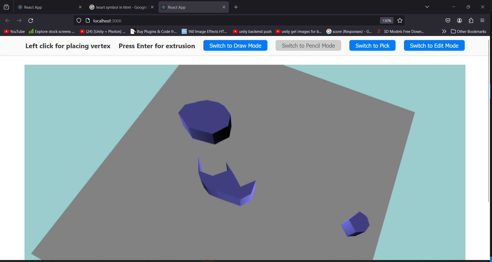

<!DOCTYPE html>
<html lang="en">
<body>
    

        <h1>3D Scene Builder Application</h1>
        <h2>An interactive web application for creating, modifying, and interacting with 3D objects using Babylon.js within a React framework.

        

        <h2>Key Features</h2>
        <ul>
            <li>Drawing Shapes</li>
            <li>Extruding Shapes</li>
            <li>Moving Polygons</li>
            <li>Editing Vertices</li>
            <li>Interactive UI</li>
        </ul>
        

        <h2>Controls and Interactions</h2>
        <ul>
            <li>Draw Mode: Activate draw mode to start creating shapes. Left-click to place vertices and press 'Enter' to complete the shape and extrude it.</li>
            <li>Move Mode: Switch to move mode to reposition polygons. Click on a polygon to select it, then click and drag to move.</li>
            <li>Edit Mode: In edit mode, click on individual vertices to move them, adjusting the shape of the polygon.</li>
            <li>3D Mode: Toggle between draw mode and 3D mode using the navbar button. 3D mode allows for viewing and interacting with the scene without drawing or editing.</li>
        </ul>
        <h2>Setup and Architecture</h2>
        
The application is built using React for the UI and Babylon.js for 3D rendering. It is structured around main scene components, with additional components for UI controls like the navbar and footer.

        

        <h2>Application Overview</h2>
        

            
        

        <video width="320" height="240" controls>
            <source src="./public/ExtrusionVideo.mp4" type="video/mp4">
            Your browser does not support the video tag.
        </video>
    

</body>
</html>
